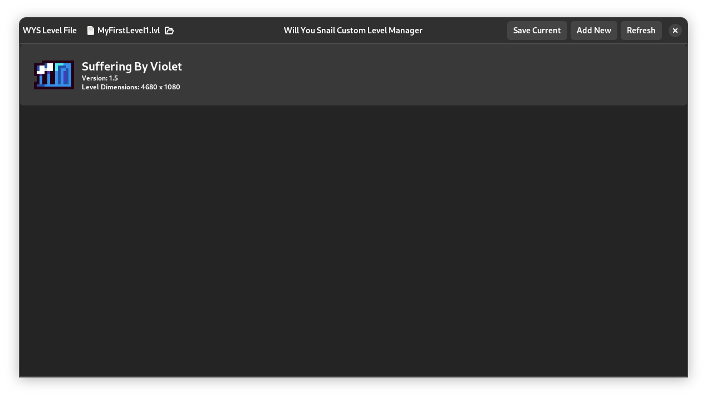

# A Will You Snail Custom Levels Manager
## A simple GTK application for the new level editor alpha in Will You Snail

This is a simple client Will you snail, it makes managing custom levels easy, for both sharing and downloading new levels.

# How to install this client?

1. Go to the Releases Page
2. Download the latest version for your computer
3. Extract and run

If it doesnt open on windows you may need to install [the runtime for GTK](https://github.com/tschoonj/GTK-for-Windows-Runtime-Environment-Installer/releases)

# What features does this client have?

 - Have a nice list of current levels
 - Simple 3 clicks to load a level
 - Makes it easy to share levels with other people

# How do I use this client?

## How do I load a level?

1. Left Click on the level you want to load
2. Click Yes to override the currently loaded level
3. In the Will You Snail level editor, press F2 to load the level
4. In the Will You Snail level editor, press F3 to play the level

## How do I add new levels I downloaded from the internet

1. Click Add New in the top right
2. Select the .lvl file you downloaded

## How do I add a level I made myself?

1. Click Save Current in the top right
2. Name the level

## How do I find the level I added?

1. Right click on a level in the list
2. Select Open Folder in the menu
